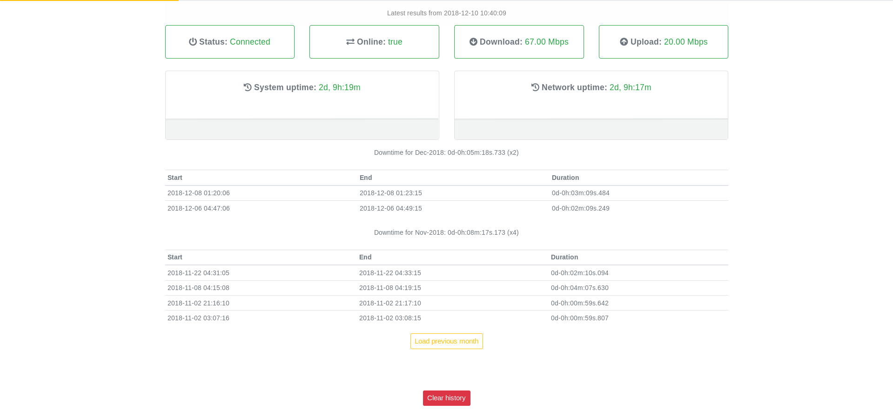

# BT monitor tool

A Django app to scrape stats from BT Smart Hub status page and display them in real time.

It was created for BT Smart Hub 6.



### Installation

##### Backend:

Requires [Python](https://www.python.org/) 3.5+ to run.

```bash
$ pip install --user pipenv
$ cd btmonitor
$ pipenv sync
```

Clone the repository and then use the [local_settings.py.tpl](btmonitor/btmonitor/local_settings.py.tpl) template file to configure all required settings.

```bash
$ export DJANGO_SETTINGS_MODULE=btmonitor.local_settings
$ python manage.py makemigrations
$ python manage.py migrate
$ python manage.py runserver
```

Add cronjob to fetch data:

```
DJANGO_SETTINGS_MODULE=btmonitor.local_settings
*/1 * * * * cd ~/btmonitor/btmonitor && /usr/local/bin/pipenv run python manage.py fetch &>/dev/null
```

API endpoints:

*/api/sitepingers/\<id\>/*

```
$ curl -s http://localhost:8000/api/sitepingers/1/ | python -m json.tool
{
    "id": 1,
    "note": null,
    "status": "Connected",
    "system_uptime": "4 04:06:00",
    "network_uptime": "1 17:22:00",
    "down_sync": "74.00 Mbps",
    "up_sync": "20.00 Mbps",
    "req_time": "00:00:04.258968",
    "created": "2018-07-11T22:34:08.791314+01:00",
    "online": true
}
```

*/downtime/\<YYYY\>/\<MM\>/*

```
$ curl -s http://localhost:8000/api/downtime/2018/12/ | python -m json.tool
{
    "date": "2018-12-01T00:00:00",
    "total": "318.73332",
    "results": [
        {
            "start": "2018-12-08T01:20:06.475799Z",
            "end": "2018-12-08T01:23:15.960140Z",
            "duration": "189.484341"
        },
        {
            "start": "2018-12-06T04:47:06.517518Z",
            "end": "2018-12-06T04:49:15.766497Z",
            "duration": "129.248979"
        }
    ]
}
```

##### Frontend:
Requires [Node.js](https://nodejs.org/) v10.6.0+ to run.

```bash
$ cd btmonitor/frontend
$ npm install
$ npm run build
```
